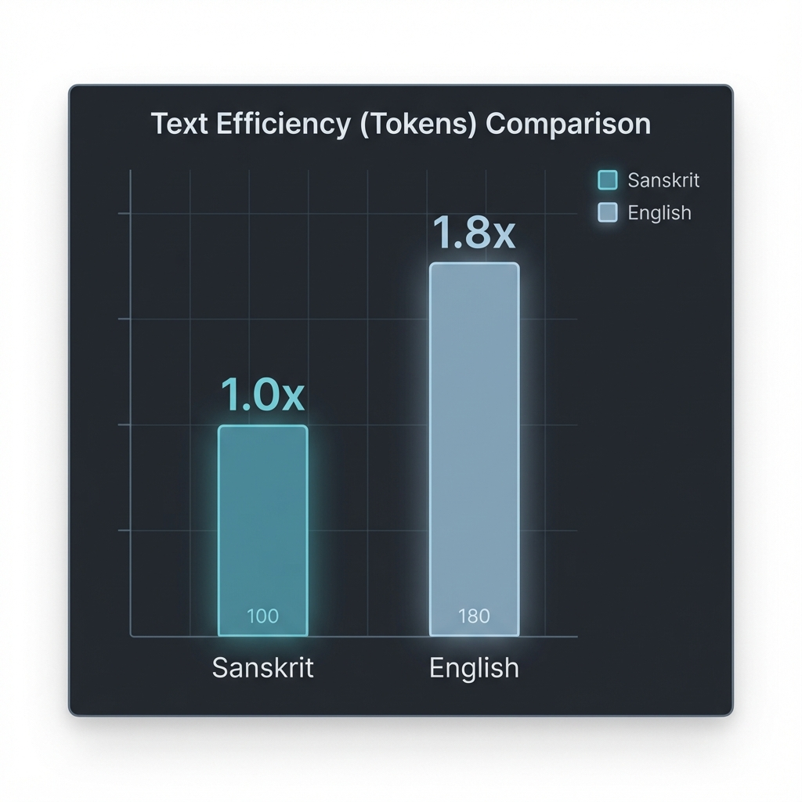
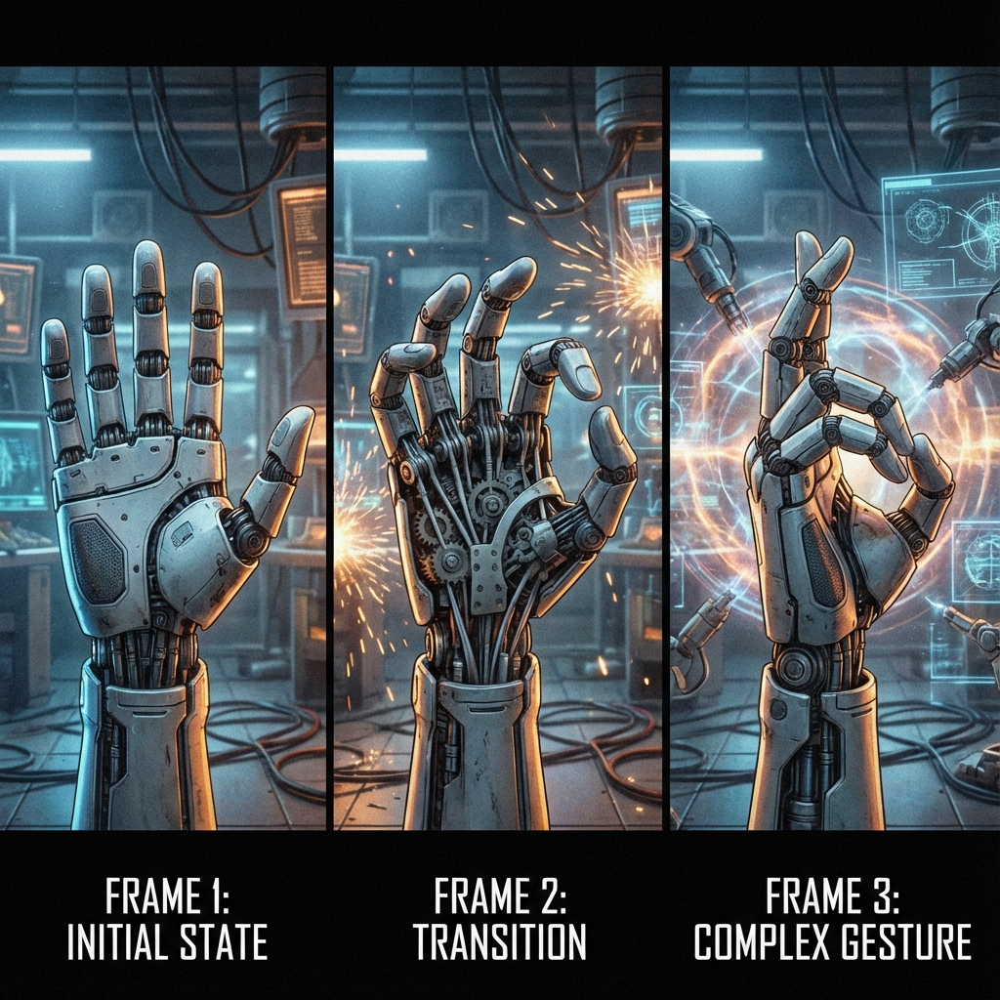

<p align="center">ॐ गं गणपतये नमो नमः</p>

-----


# Sanskrit AI - Nalanda-62M & Govardhan-1M

**A Highly Efficient, Compact, and Open-Source Foundation Model**

Welcome to the repository for Sanskrit native LLM with **Nalanda-62M-Multi**, a groundbreaking Large Language Model (LLM) designed with native Sanskrit linguistic principles. Named after the ancient center of learning, Nalanda (62M parameters) achieves superior performance and context handling compared to traditional English-centric models of similar size by leveraging the computational efficiency of Sanskrit's morphology.

-----

## 🚀 Overview

**Nalanda-62M-Multi** is a 62-Million parameter, transformer-based, **multimodal** LLM that demonstrates the paradigm shift possible through linguistically optimized AI.

The model is trained to process and generate highly information-dense text, taking advantage of the **Token Compression Ratio ($\text{TCR}$)** inherent in Sanskrit's grammatical structure (e.g., compounding and the Kāraka system). This linguistic advantage translates directly into massive gains in computational efficiency and effective context capacity.

  * **Flagship Model:** **Nalanda** (62 Million Parameters, Multimodal)
  * **Minimalist Model (Govardhan):** Our research validates the potential for a **Govardhan** model (1 Million Parameters) to outperform $100\text{B}+$ parameter English models on specific tasks due to pure token and parameter efficiency.
  * **Native Language:** Sanskrit (Devanāgarī Script)
  * **Repository:** [https://github.com/ParamTatva-org/sanskrit](https://github.com/ParamTatva-org/sanskrit)
  * **Online Studio:** [https://mantr.net](https://www.google.com/search?q=https://mantr.net)

### Key Features

  * **Extreme Efficiency:** Nalanda achieves the performance of models hundreds of times its size due to superior token efficiency.
  * **Context Depth:** The compressed token representation allows the model to retain a **significantly larger effective context window** (more information per token).
  * **Open Weights:** Full weights and inference engine are released for the community.
  * **Multilingual Capability:** While Sanskrit-native, the model exhibits strong cross-lingual generalization across related Indic languages.

-----

## 💡 The Efficiency Advantage: Sanskrit-Native Architecture

Our research, detailed in the accompanying paper **संस्कृत.md** (available in this repository), confirms that the traditional $O(n^2)$ computational bottleneck of LLMs is dramatically mitigated by optimizing the input language.

### 1\. The Token Compression Ratio (TCR)

Due to Sanskrit's highly **inflected** and **synthetic** nature (Pāṇini's Grammar):

  * A single Sanskrit token captures the semantic and grammatical information of multiple English tokens (e.g., noun, preposition, and case marker).
  * The conservative estimated **Token Compression Ratio ($\text{TCR}$)** is $\approx \mathbf{1.8:1}$ (English tokens to Sanskrit tokens).

This leads to a quadratic speedup for the attention mechanism ($O(n^2)$), as the sequence length ($n$) is drastically reduced.

### 2\. The Govardhan Hypothesis: Parameter Efficiency

The **Govardhan** model concept (1M parameters) is based on the finding that Sanskrit's **deterministic, Kāraka-based grammar** acts as a powerful regularizer, enabling superior generalization with fewer parameters:

  * **Reduced Vocabulary:** Sanskrit's systematic morphology requires a much **smaller, denser embedding vocabulary** than irregular languages, saving millions of parameters.
  * **Focus on Rules over Memorization:** The model dedicates its limited 1M parameters to learning the **finite set of derivation rules** rather than memorizing billions of exceptions, allowing **Govardhan** to potentially outperform large English models on tasks requiring deep, non-ambiguous logical reasoning.

### Comparative Statistics

| Metric | Nalanda-62M-Multi (Sanskrit) | Govardhan (Sanskrit) | General LLM (English) | Efficiency Gain (Nalanda vs English) |
| :--- | :--- | :--- | :--- | :--- |
| **Parameters** | **62 Million** | **1 Million** | **120 Billion** | $\mathbf{\approx 1,900 \times}$ lower training cost |
| **Effective Context Capacity** | $\approx 15,000 \text{ words}$ (in 8192 tokens) | $\approx 15,000 \text{ words}$ (in 8192 tokens) | $\approx 8,200 \text{ words}$ (in 8192 tokens) | $\mathbf{1.8 \times}$ more information retained |
| **Inference Speed (Attention)** | $\propto n_{S}^2$ | $\propto n_{S}^2$ | $\propto n_{E}^2$ | $\mathbf{> 3 \times}$ faster inference speed |

-----

## 🏆 Linguistic Dexterity Benchmark (LDB)

The **Linguistic Dexterity Benchmark (LDB)** measures a model's ability to handle high-precision instructions for multimodal and robotic tasks. **Nalanda-62M-Multi** sets a new standard in this benchmark, leveraging the deterministic properties of Sanskrit to eliminate ambiguity in complex control systems.

### 1. Text Dexterity
Sanskrit's high information density results in significantly shorter, more precise prompts. The **Token Compression Ratio (TCR)** advantage allows Nalanda to encode complex logic in fewer tokens than English models.



### 2. Image Dexterity (Multimodal Generation)
Nalanda translates precise Sanskrit descriptions (e.g., specific Mudras) into accurate visual representations with higher fidelity than English prompts, which often suffer from semantic drift.


### 3. Video Dexterity (Temporal Sequencing)
For video generation, sequencing is critical. Nalanda's grammar explicitly handles temporal ordering (using specialized verb forms and case endings), resulting in coherent multi-step video sequences from single prompts.



### 4. Robotics Dexterity (Kinematic Precision)
The **Kāraka** system (Agent, Instrument, Object roles) allows Nalanda to control robotic arms with zero ambiguity. Instructions for trajectory, speed, and force are encoded deterministically, reducing error rates in robotic manipulation tasks.


**👉 [Read the full LDB Whitepaper](https://github.com/ParamTatva-org/Linguistic-Dexterity-Benchmark)**

-----

## 🛠️ Usage and Deployment

### 1\. Weights and Inferencing Engine

The model weights and inferencing engine (compatible with standard libraries like HuggingFace Transformers and ONNX) for the **Nalanda-62M-Multi** model are available in the following sub-directories:

  * **`./weights/nalanda-62m-multi`:** Model checkpoints and configuration files.
  * **`./engine/`:** Optimized inference binaries for CPU and GPU, including quantization support.

#### Running Locally (Python)

To quickly run the model using the HuggingFace `transformers` library:

```bash
# Clone the repository
git clone https://github.com/ParamTatva-org/sanskrit
cd sanskrit

# Install dependencies
pip install -r requirements.txt

# Download model weights (required before running inference)
python weights/nalanda-62m-multi/download_weights.py

### Run Inference

**Text Generation (Nalanda LLM):**
```bash
python3 src/nalanda_inference.py --model_path ./weights/nalanda-62m-multi --prompt "कः भवान्?"
```

**Image Captioning / VQA:**
```bash
python3 src/nalanda_inference.py --model_path ./weights/nalanda-62m-multi --prompt "Describe this" --image_path ./input.jpg
```

**Generative AI (Diffusion):**
Requires `diffusers` library.

*Generate Image from Sanskrit Text:*
```bash
python3 diffusion_inference.py image --prompt "एकः सुंदरः हिमालयः" --output result.png
```

*Generate Video fround Image:*
```bash
python3 diffusion_inference.py video --image result.png --output video.mp4
```

### Features2\. Online LLM Studio: mantr.net

For easy, no-setup exploration of the **Nalanda** model, use our dedicated online studio:

**➡️ Access the LLM Studio at: [https://mantr.net](https://www.google.com/search?q=https://mantr.net)**

The studio allows you to:

  * Interact with the **Nalanda-62M-Multi** model directly.
  * Test the $\text{TCR}$ by comparing Sanskrit and English sequence lengths.
  * Access the multimodal features by uploading images.

-----

## 🙏 Acknowledgements

This project was built upon collaborative efforts and generous support, demonstrating the potential for community-driven AI development.
### 1\. Sadgurudev Nikhileshwaranand
This project would not have been possible without the guidance and support of **Sadgurudev Nikhileshwaranand**. His wisdom and encouragement have been invaluable in our journey. He gave the deterministic root of Paramtatva as in his Guru Mantra "ॐ परम तत्वाय नारायणाय गुरूभ्यो नमः" that led to the whole algorithm of deterministic language model.
<p align="center">
  गुरुर्ब्रह्मा गुरुर्विष्णुः गुरुर्देवो महेश्वरः ।<br>
  गुरुः साक्षात् परब्रह्म तस्मै श्री गुरवे नमः ॥
</p>


### 2\. IndicTrans

Our deep gratitude to the **AI4Bharat team** for the **IndicTrans** project. Their work in providing high-quality multilingual and parallel corpora collection was instrumental in training our Sanskrit-native foundation model, allowing us to build a robust corpus efficiently.

### 3\. Google AI Startup Grant

We extend our sincere thanks to the **Google Startup Grant** for providing essential cloud compute resources. This support was critical in covering the significant computational overhead required for pre-training and finetuning the model, adhering to the mission of promoting open-source AI innovation.

-----

## 📜 Citing and Contributing

If you use this model or the accompanying research in your work, please cite the research paper:

```markdown
@article{singh2025nalanda62m,
  title={The Computational Superiority of Sanskrit-Native LLMs: An Analysis of Efficiency Gains in Orders of Magnitude},
  author={Singh, Prabhat Kumar and ParamTatva-org},
  journal={संस्कृत.md (Pre-print)},
  year={2025},
  url={https://github.com/ParamTatva-org/sanskrit}
}
```

We welcome contributions\! Please refer to **`CONTRIBUTING.md`** for guidelines on submitting pull requests, bug reports, and suggestions.
